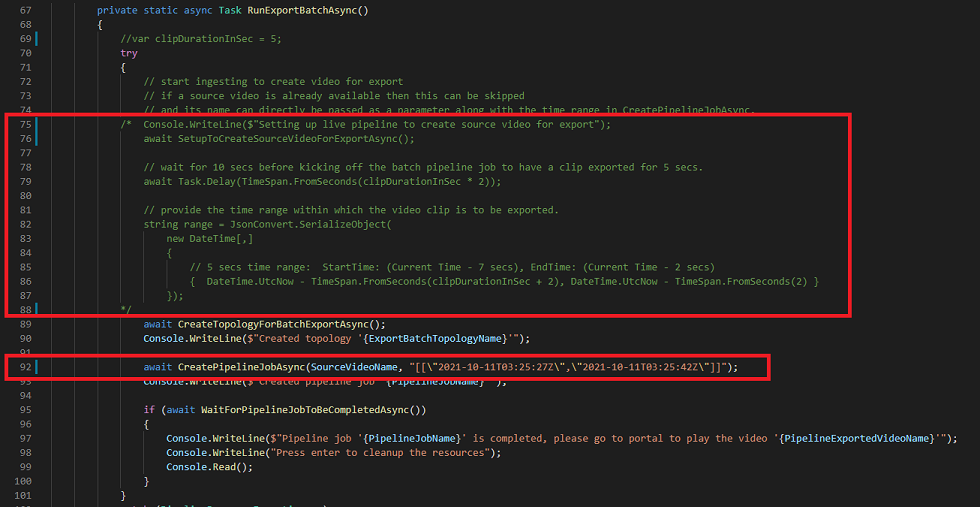

# Azure Video Analyzer sample to export a portion of a recorded video as an MP4 file

This folder contains a .NET Core console app that enables you to export a portion of a recorded video as an MP4 file.

### Contents

| File             | Description                                                   |
|-------------------------|---------------------------------------------------------------|
| `ExportBatchPipelineJobSampleCode.csproj`| Project file                                                 |
| `Program.cs`            | The main program file                                         |

### Pre-requisites

1. An Azure account that includes an active subscription. [Create an account](https://azure.microsoft.com/free/?WT.mc_id=A261C142F) for free if you don't already have one.
    * Get your Azure Active Directory [Tenant Id](https://docs.microsoft.com/azure/active-directory/fundamentals/active-directory-how-to-find-tenant)
    * Register an application with Microsoft identity platform to get app registration [Client Id](https://docs.microsoft.com/azure/active-directory/develop/quickstart-register-app#register-an-application) and [Client secret](https://docs.microsoft.com/azure/active-directory/develop/quickstart-register-app#add-a-client-secret)

1. Create a [Video Analyzer account](https://docs.microsoft.com/azure/azure-video-analyzer/video-analyzer-docs/create-video-analyzer-account?tabs=portal).

1. [Visual Studio Code](https://code.visualstudio.com/) on your development machine with following extensions -
    * [Azure IoT Tools](https://marketplace.visualstudio.com/items?itemName=vsciot-vscode.azure-iot-tools)
    * [C#](https://marketplace.visualstudio.com/items?itemName=ms-dotnettools.csharp)

1. [.NET Core 3.1 SDK](https://dotnet.microsoft.com/download/dotnet-core/3.1) on your development machine.

1. A recorded video in the Video Analyzer account, or an [RTSP camera](https://aka.ms/service-supported-cameras) accessible over the internet. Alternatively, you can deploy an [RTSP camera simulator](https://aka.ms/deploy-rtsp-camsim).

### Setup

- Open your local clone of this git repository in Visual Studio Code.
- Go to `src\video-export\Program.cs` and provide values for the following variables:

| Variable       | Description                                |
|----------------------|--------------------------------------------|
| SubscriptionId | Provide Azure subscription Id    |
| ResourceGroup | Provide resource group name |
| AccountName | Provide Video Analyzer account name |
| TenantId | Provide tenant id |
| ClientId | Provide app registration client id |
| Secret | Provide app registration client secret |
| AuthenticationEndpoint | Provide authentication end point (example: https://login.microsoftonline.com) |
| ArmEndPoint | Provide ARM end point (example: https://management.azure.com) |
| TokenAudience | Provide token audience (example: https://management.core.windows.net) |
| PublicCameraSourceRTSPURL *(optional)* | Provide RTSP source url  |
| PublicCameraSourceRTSPUserName *(optional)* | Provide RTSP source username |
| PublicCameraSourceRTSPPassword *(optional)* | Provide RTSP source password |
| SourceVideoName | Provide source video name for export |

**NOTE: If you already have a video recording in your Video Analyzer account**, the 3 RTSP parameters in the table are optional. See the [`Use existing video`](#use-existing-video) section for the necessary code changes.

- Optionally, you can provide custom values for the pipeline parameters and parameter names, defined just below the variables mentioned in the table (lines 37 - 52).
- Save the changes.

### Code walkthrough

In this section, we will be describing the steps in Program.cs

The Main() is the starting point with two function calls:

```
public static async Task Main(string[] args)
{
    await SetupClientAsync();
    await RunExportBatchAsync();
}
```

- SetupClientAsync() method is used for service principal authentication.
- RunExportBatchAsync() method is used to run a pipeline job for exporting a portion of the video recording as an MP4 file. This method does the following:

    1. Start capturing and recording live video from the RTSP camera that is accessible over the internet
        * SetupToCreateSourceVideoForExportAsync() method starts recording live video from the RTSP camera at `PublicCameraSourceRTSPURL`.
        * If a video recording is already available in your Video Analyzer account(the video resource should be of type `archive`), then this step can be skipped and name of the video resource can be directly passed as a parameter along with the time range in CreatePipelineJobAsync() in line 92. See [Use existing video](#use-existing-video) section for the necessary code changes.

    1. Using the video recorded in above step as the source, create a [batch pipeline topology](https://docs.microsoft.com/azure/azure-video-analyzer/video-analyzer-docs/pipeline#batch-pipeline).
        * CreateTopologyForBatchExportAsync() method creates that topology with the following nodes:
            *  Video source node
            *  Encoder processor node - with a System Preset configuration. More details [here](#encoder-processor-node).
            *  Video sink node

    1. On successful creation of the topology, a pipeline job is created and activated.
        * CreatePipelineJobAsync() method takes 2 parameters:
            *  `PublicCameraVideoName` - source video name, either created programmatically in step 1 or the name provided by you. Make sure that you provide a video resource that is available in the Video Analyzer account and is in an `archive` state. 
            *  `range` - The time sequence, that is the start and end timestamp of the portion of the recorded video to be exported, which is specified in UTC time. The maximum span of the time sequence (end timestamp - start timestamp) must be less than or equal to 24 hours. Default value is 5 seconds which can be modified by updating `clipDurationInSec` variable in line 69.

    1. On successful completion of the pipeline job, a new video resource named **batch-pipeline-exported-video** is added to your Video Analyzer account, as type `file`. Make sure to change the variable `PipelineExportedVideoName` in line 43 on subsequent runs.

### Running the sample

Once you have the configuration steps completed, you can run the program.

- Start a debugging session. 
    * You can set this project as default project to run on hitting F5 by modifying the files in .vscode folder. Learn more [here](https://github.com/OmniSharp/omnisharp-vscode/blob/master/debugger-launchjson.md).
        * `launch.json` - Update the **"program"** and **"cwd"** to launch ExportBatchPipelineJobSampleCode.
        * `tasks.json` - Update **"args"** to point to ExportBatchPipelineJobSampleCode.csproj.
    * Alternatively, go to TERMINAL window in the Visual Studio Code, navigate using `cd <path>` to src/video-export. Type commands `dotnet build` and `dotnet run` to compile and run the program respectively.  
- You will start seeing some messages printed in the TERMINAL window regarding creation of the topologies and pipelines. If the job is successful, you can go to the Azure portal to download the MP4 file. 
- Login to [Azure portal](https://portal.azure.com/), go to the Video Analyzer account being used for this project.
- Click on Videos blade and choose the video resource created by the pipeline job. The default video name is **batch-pipeline-exported-video**, stored in the variable `PipelineExportedVideoName` in line 43. Click on the video, and it will trigger a download and playback in the browser window. Alternatively, you can download the file.
- Go back to Visual Studio Code TERMINAL window and press enter to cleanup the resources including the pipelines and topologies. The exported MP4 file is persisted.

### Use existing video

If a video recording is already available in your Video Analyzer account (should be of type `archive`), then -
 
* You can skip the step to create a live pipeline in SetupToCreateSourceVideoForExportAsync() method. To skip this step, comment the code from lines 75 to 87 as shown in the screenshot.
* In CreatePipelineJobAsync() method at line 92, set the `range` to a suitable time range that matches the timeline of the recorded video as shown in the screenshot. Time range should be specified as [start time, end time] in the format `[[\"YYYY-MM-DDThh:mm:ssZ\",\"YYYY-MM-DDThh:mm:ssZ\"]]`.  

<br>
<p align="left">
  
</p>
<br>


### Encoder processor node

The encoder processor node can only be used in batch pipeline topologies and allows you to specify encoding properties when converting the recorded video into the desired format for downstream processing. It only supports encoding video with H.264 codec and audio with AAC codec.

Two types of preset configurations allowed in an encoder processor are: 
* System Preset
* Custom Preset

    The allowed configurations for each preset are listed in the table below. 
     
     | Configuration       | System Preset        | Custom Preset |
     | ----------------| --------------|--------------|
     | Video encoder bitrate kbps      | same as source      | 200 to 16,000 kbps |
     | Frame rate       | same as source      | 0 to 300 |
     | Height    | same as source        | 1 to 4320 |
     | Width    | same as source       | 1 to 8192 |
     | Mode   | Pad        | Pad, PreserveAspectRatio, Stretch |     
     | Audio encoder bitrate kbps  | same as source        | Allowed values: 96, 112, 128, 160, 192, 224, 256 | 

The code uses `EncoderSystemPreset` in CreatePipelineTopologyForExportModel() with `SingleLayer_1080p_H264_AAC` preset type. 

```csharp
Preset = new EncoderSystemPreset
{
    Name = "SingleLayer_1080p_H264_AAC",
},
```

Allowed system preset type names are:

| System Preset Type       | Audio AAC properties        | Video H.264 properties | Scale Mode |
| ----------------| --------------|--------------|--------------|
| SingleLayer_540p_H264_AAC       | same as source      | Bitrate: 2000 kbps, Height: 540, Width: 960 | PreserveAspectRatio |
| SingleLayer_720p_H264_AAC       | same as source      | Bitrate: 3500 kbps, Height: 720, Width: 1280  | PreserveAspectRatio |
| SingleLayer_1080p_H264_AAC      | same as source      | Bitrate: 6000 kbps, Height: 1080, Width: 1920  | PreserveAspectRatio |
| SingleLayer_2160p_H264_AAC      | same as source      | Bitrate: 16000 kbps, Height: 2160, Width: 3840  | PreserveAspectRatio |

If you want to customize the video and audio encoding for exported video, use `EncoderCustomPreset`. Sample code to use the `EncoderCustomPreset` property is as follows:

```csharp
Preset = new EncoderCustomPreset
{ 
    VideoEncoder = new VideoEncoderH264
    {
        BitrateKbps = "3500",
        FrameRate = "30",
        Scale = new VideoScale
        {
            Height = "1080",
            Width = "1920",
            Mode = "Pad",
        },
    },
    AudioEncoder = new AudioEncoderAac
    {
        BitrateKbps = "96",
    },
},
```

### Next steps

- Try the tutorial to export a portion of recorded video as an MP4 file [using Azure portal](https://aka.ms/export-to-mp4)
- Learn more about [live and batch pipelines](https://docs.microsoft.com/azure/azure-video-analyzer/video-analyzer-docs/pipeline)
- [Quotas and limitations](https://aka.ms/livequota) on batch pipelines
